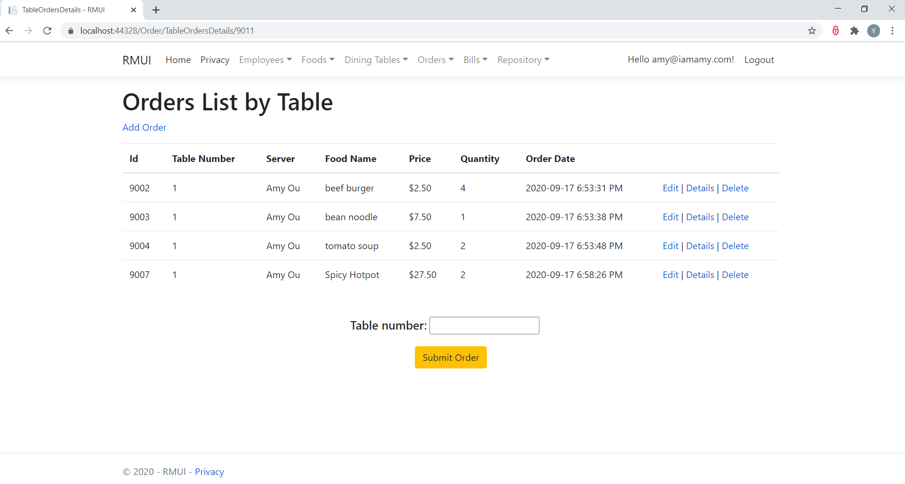

# Restaurant Management App (.NETCore3.1 MVC)

<h3> Home Page with all controllers shown as dropdown lists in the menu bar</h3>

<h3> The app supports Authentication and Authorization, which requires user login to use different functions of the app. </h3>

<h3> Person Controller -- inserting new employee into database </h3>

<h3> Person Controller -- editing employee info </h3>

<h3> Person Controller -- viewing all employees </h3>

<h3> DiningTable Controller -- inserting new dining table into database </h3> 

<h3> DiningTable Controller -- editing dining table </h3>

<h3> DiningTable Controller -- viewing all dining tables. The Edit link allows redirecting to the Edit view and the Delete link allows direct deletion of the dining table info. </h3>

<h3> Food Controller -- inserting new food type into database </h3>

<h3> Food Controller -- viewing all food types. The Delete link directly deletes the corresponding food type info. </h3>

<h3> Food Controller -- inserting new food into database, , deleting food and viewing all foods in the database.  </h3>

<h3> Food Controller -- editing food </h3>

<h3> Food Controller -- viewing all foods, with each food belongs to a specific food type. The Edit, Details and Delete link allows editing food, viewing food details and deleting food respectively. </h3>

<h3> Order Controller -- inserting a food order for a specific dining table. The table number and server name can be selected from the dropdown lists. The food type list and food name list are cascading dropdowns. A selected food type will trigger foods that belong to this food type to populate in the food name dropdown. When a certain food name is chosen its price will be automatically filled in the price field. The View Order Summary button allows us to view the order details of the provided dining table number. </h3>

<h3> Order Controller -- viewing the order details of specific dining table. In addition to the above View Order Summary request, the Search Order action can also lead to this page. The Edit, Details and Delete link allows editing ordered food, viewing ordered food details and deleting ordered food respectively. If there is no question about the order summary for this specific dining table we can type in the table number and submit the order. </h3>

<h3> Order Controller -- viewing ordered food </h3>

<h3> Order Controller -- editing ordered food </h3>

<h3> Order Controller -- searching for order details based on table number </h3>

<h3> An error message will show up if currently there is no active order for the searched table </h3>

<h3> Order Controller -- viewing the summary of all active orders. The Edit, Details and Delete link allows editing order summary, viewing ordered food details and deleting order summary respectively. </h3>

<h3> Order Controller -- editing order summary</h3>

<h3> Order Controller -- viewing ordered food details of a specific table. The Edit, Details and Delete link allows editing ordered food, viewing ordered food details and deleting ordered food respectively. </h3>

<h3> Bill Controller -- searching the bill for specific table. An error message will show up if the searched table doesn't exist or currently there is no active order for the searched table. </h3>

<h3> Bill Controller -- viewing the bill details returned by search. If there is no question about the bill we can type in the table number and request bill payment. </h3>

<h3> Repository Controller -- viewing the order summary of all paid and unpaid orders. /h3>

<h3> Repository Controller -- viewing the ordered food details of all paid and unpaid orders. </h3>

<h3> Repository Controller -- For the ordered food of specific dining table, the Order Id is 0 before bill payment. </h3>

<h3> This dining table's Order Id will be assigned to each of its ordered food after bill payment. </h3>

